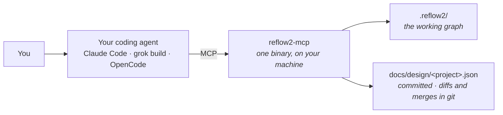

# reflow2 — "Design Anything, Build Anything"

> ### 👉 New here? Start with **[What it actually is, concretely](#what-it-actually-is-concretely)** — one screen: the physical shape, the install line, and the first thing you'd type.
> Full setup, including verifying it works, is **[getting-started/SETUP.md](getting-started/SETUP.md)**.
> Everything after that first section is about reflow2's own internals.

**reflow2 is a persistent design brain for building things with an AI agent.** It keeps a
project's entire design — requirements, capabilities, components, code, tests, releases — in
one schema-validated graph that outlives any chat session, and keeps that design *coherent*:
when anything changes, reflow2 finds what the change touches, asks you plain-language
questions about what's undecided, and refuses to let the design quietly drift from what was
actually built. You drive it from a coding agent (Claude Code, grok build, OpenCode, Copilot)
over MCP; the graph carries the systems-engineering discipline so you don't have to.

**New to the internals? Read [docs/overview.md](docs/overview.md) first** — it maps all the
documents and how they fit together.

## What it actually is, concretely

Before any of the ideas below — the physical shape, because almost every wrong assumption about
reflow2 is an assumption about its shape:

**It is a program that runs on your own machine.** It keeps your design as **a file in your own
repository**. **Your coding agent talks to it over MCP**, so you use it by talking to your agent
rather than by running commands. **Nothing leaves your machine** — there is no service, no account
and no telemetry.



### Running it

One command, once per machine — **not once per project**:

```bash
curl -fsSL https://raw.githubusercontent.com/sligara7/reflow2/main/tools/install.sh | sh
```

That installs the binary, registers the MCP server for **every** project on the machine, and
drops in the slash commands and hooks. **There is nothing to put in your project** — no config to
write, no instruction file to place. A folder you never design in stays untouched and gets a
server that says exactly that.

### The first thing you'd do

Start your agent in a project directory and say one of three things, depending on where you are:

| Where you are | What you say |
| --- | --- |
| A new thing, nothing built yet | `/genesis I want to build …` — a paragraph is plenty |
| Code, hardware or documents that already exist, with no design written down | `/adopt` |
| A design somebody else built and handed you | `/where`, then `/where-does-it-go` when you have a task |

Never seen it before? Ask your agent **`/what-is-this`** and it will explain reflow2 in its own
words before you read another line of this file.

### What it can answer that nothing else can

Worth knowing before you decide whether it is for you, because a tool described only by its checks
reads as a linter:

- **"How much of what we said we'd build actually works?"** — computed from the traceability
  thread, not from anyone's status field: something satisfies each requirement, the thing that
  satisfies it is built, and its check passes. Nobody can inflate it by marking their own work done.
- **"Why is it like this?"** — the reasoning behind decisions, the alternatives rejected, and the
  name of the person who decided. This is the one that survives people leaving.
- **"What breaks if I change this?"** — the blast radius along the golden thread, before the edit.
- **"I'm new here — where does this new feature belong?"** — which part should own it, and which
  decisions already govern that ground.

**The honest cost:** reflow2 only knows what somebody told it. A design nobody has captured
answers nothing, and the capture is real work.

Full setup, including verifying it works: **[getting-started/SETUP.md](getting-started/SETUP.md)**.

---

*Everything from here down is about reflow2's own internals and design philosophy.*

## Vision

Capture the **entire lifecycle — concept → operations — in one graph**, tied together by
the systems-engineering *golden thread*. When anything changes in any phase, the ripple
effects are **automatically detected, surfaced to the user as plain questions, and healed**
back to coherence — so concept through operations always stays in agreement. The user
never needs to know systems engineering; the graph does. See
[docs/vision.md](docs/vision.md) — it's the north star for everything below.

The engine is the **coherence loop**: `CHANGE → PROPAGATE → DETECT → SURFACE → HEAL →
COHERENCE` — where PROPAGATE walks the golden thread to find a change's blast radius
([docs/impact-propagation.md](docs/impact-propagation.md)).

## What this is

A graph-backed workflow engine that partners with an LLM agent to **design and
build anything** — not just software: hardware, a document, a process, a full program.
A design moves along a phase spine (**WHAT → WHERE → BUILD → VERIFY → OPERATE**), and two
foundations carry it:

1. **The store** is a schema-driven graph engine inside `reflow2-core` — RocksDB or an
   in-memory backend, with BM25 text search and fuzzy/vector entity resolution. The vocabulary is
   enforced on every write: an invented node or edge type is *refused*, loudly, with the real
   alternatives named. It began as [dynograph-foundation](https://github.com/sligara7/dynograph-foundation)
   and the subset reflow2 actually used was **absorbed into this repository on 2026-08-24**
   (`dec:absorb-the-foundation-subset-and-end-the-dependency`); nothing is pulled from that
   repository any more. The RocksDB C++ build stays opt-in behind a feature flag, so the core
   still runs on the in-memory backend with no long compile.
2. **Design capture is extraction, not data entry**: freeform input — a brief, a
   conversation, prose read out of an existing codebase — is extracted into typed graph
   nodes in schema-driven, phase-aware, multi-pass fashion, with graph-informed dedup and
   provenance on every claim.

## "How do you know the LLM didn't just hallucinate something?"

It's the first question anyone asks about a tool that works with an LLM, and it deserves a
straight answer rather than reassurance. reflow2 is built as a **three-party system** — you, the
graph, and the LLM — where each party checks the others, and the LLM is structurally barred from
the jobs it is bad at. The honest version, objection by objection:

**"It invents things."** Structurally, it can't land them. The graph's vocabulary is
schema-enforced: an invented node type, edge type or property is *refused*, loudly, with the real
alternatives named. Structural repairs execute only if the engine independently re-derives them
from the graph at apply time — a hallucinated merge is rejected before a single write. And what the
LLM *can* freely write — descriptions, statements, prose — is attributed, dated, and marked with
provenance (`inferred` when it was read out of code rather than stated by you), so a claim is never
just a sentence: it is a sentence with a paper trail.

**"It forgets, and it drifts."** The graph is the memory, not the context window. Questions you
were asked persist across sessions *in the exact words you saw*; decisions are recorded with their
rationale; the same graph produces byte-identical exports and the same gaps in any session, on any
machine. The deterministic core — not the LLM — does all counting, ranking and graph analysis, so
there is no arithmetic to hallucinate.

**"It just agrees with you."** The detectors don't negotiate. A gap re-fires every run until the
structure actually changes or a *human* accepts it with a recorded reason — agreement has to leave
a Decision node, not a pleasant sentence. When built code drifts from the design, accepting the new
reality **requires** answering "did the design move too?" — the agreeable silent path was removed
on purpose, because it is how a design erodes into fiction while reporting zero problems.

**What it can't do — said plainly.** No mechanism here stops an LLM from writing a false sentence
into a description. What the graph guarantees instead is that the sentence is *checkable*: the
confirmation ledger shows, per capability, whether anyone has examined the claim against reality —
and `unexamined` is a visible state, never silently equal to "fine." The judgment seat belongs to
you; the machinery's job is making sure nothing reaches you unattributed, uncounted, or quietly
forgotten.

The full map — every known LLM failure mode against the mechanism that checks it, including the
ones still uncovered — is **[docs/partnership.md](docs/partnership.md)**. It is kept honest the
same way everything else here is: coverage is claimed only where a named mechanism enforces it.

## The design vocabulary

Domain-neutral node types, layered by the phase they feed (29 node types and 64 edge types
across 11 schema domains; see [docs/overview.md](docs/overview.md) and `tools/validate_schema.py`):

| Phase / layer | Nodes |
|-------|-------|
| P0 · Intent | `Project`, `Requirement`, `Constraint`, `DesignRule` |
| P1 · Function (WHAT) | `Capability`, `Flow`, `Actor` |
| P2 · Structure (WHERE) | `Component`, `Interface`, `Decision`, `Anchor` |
| P3 · Realization (BUILD) | `Artifact`, `Fragment` |
| P4 · Verification | `Verification`, `QualityGate`, `DriftEvent` |
| P5 · Operation | `Release`, `Environment`, `Resource` |
| Operating environment | `EnvironmentRule` |
| Axis Z · change over time | `DesignEpoch`, `TemporalFact`, `Snapshot`, `ChangeEvent` |
| Cross-cutting | `DimensionAssessment`, `DimensionObservation`, `Question`, `Contributor` |

**Structural edges:** CONTAINS, PROVIDES, CONSUMES, ALLOCATED_TO, REALIZES,
VERIFIES, DEPENDS_ON, SATISFIES, PART_OF_FLOW, DEPLOYED_TO, REQUIRES_RESOURCE,
GOVERNED_BY, INCLUDES.

**Inference ("why") edges** (wildcard endpoints): CAUSES, ENABLES, BLOCKS,
TRIGGERS, CONTRADICTS, VALIDATES, VIOLATES, RISKS, MITIGATES, EVOLVES_INTO,
OBSOLETES, DUPLICATES, CONSTRAINS, ANTICIPATES, MASKS.

## Layout

```
reflow2/
  crates/
    reflow2-core/    # the deterministic, LLM-free coherence engine (59 modules)
    reflow2-mcp/     # the agent-native MCP server, stdio or HTTP (165 tools) — the binary you run
  schema/            # 11 composable schema domains (29 node / 64 edge types)
    core / functional / structure / build / verify / operate
    environment / temporal / inference / dimensions
  getting-started/   # the consumer kit installed into a project being designed
    SETUP.md         #   install + connect a coding agent + verify
    AGENTS.md        #   how an agent drives reflow2 to design YOUR project
    skills/          #   the 25 served skills (genesis, adopt, help, onboarding, …)
                     #   — SKILLS.md is the catalogue: which skill, when
    commands/        #   the slash commands that reach them
  tools/             # install.sh (one-line installer), reflow2_init.py, the trial harnesses,
                     #   build_design_graph.py (reflow2's own design), validate_schema.py
  docs/              # vision, design, and process specs — START at docs/overview.md
    overview.md · vision.md · three-axes.md · surface-plan.md · partnership.md
    requirements-coverage.md · impact-propagation.md · heal-process.md · …
  AGENTS.md          # the primary instruction file for working ON reflow2
  SKILLS.md          # which skill (and slash command) to reach for, and when
  CHANGELOG.md · COORD.md
```

## Three structural axes

Beyond phases and processes, every design is sliced along three independent axes
([docs/three-axes.md](docs/three-axes.md)):

- **X — who relates to whom**: the horizontal network of entities + typed/inference edges
- **Y — how it's built**: the vertical decomposition spine (Project ▸ Component ▸ Capability ▸ Artifact)
- **Z — how it changes**: the time axis — epochs, time-bounded facts, snapshots, change events ([schema/temporal.yaml](schema/temporal.yaml))

## Phases and processes

The **phases** (P0–P5) are the *linear lifecycle spine* — where a project is. Six
*universal graph processes* are the *cyclic engine* that runs on the graph regardless of
phase. They map onto the coherence loop; see [docs/overview.md](docs/overview.md) for the
full reconciliation.

- **GENESIS** — bootstrap the graph from a brief ([docs/genesis.md](docs/genesis.md))
- **INGEST** — extraction ([docs/extraction-plan.md](docs/extraction-plan.md))
- **DIAGNOSE → PROMPT** — find graph weaknesses & ask the user questions ([docs/gap-surfacing.md](docs/gap-surfacing.md))
- **SYNTHESIZE** — graph → artifacts (docs, diagrams, as-built) *(acknowledged; not yet detailed)*
- **HEAL** — detect & repair structural defects ([docs/heal-process.md](docs/heal-process.md))
- *(reflow2 addition)* **PROPAGATE** — ripple a change along the golden thread ([docs/impact-propagation.md](docs/impact-propagation.md))

## Status

The deterministic core and the **agent-native surface are built** — the full surface plan
(persistence, ambient-agent LLM seam, the `reflow2-mcp` MCP server, consumer kit, GENESIS,
artifact linking) is complete and cold-start-verified. See
[docs/requirements-coverage.md](docs/requirements-coverage.md) for the living status matrix and
[docs/surface-plan.md](docs/surface-plan.md) for what's built vs. the tracked future
improvements (SP-3b ingest extraction, SP-6b as-built drift). To *use* it, see
[getting-started/](getting-started/).

## Heritage

reflow2 is a clean-room rebuild of ideas the author developed across several earlier
prototypes (reflow, storyflow, chain_reflow — private repos, referenced in the docs where an
idea came from one of them). The graph engine it runs on,
[dynograph-foundation](https://github.com/sligara7/dynograph-foundation), is the author's
public library. Nothing here derives from third-party conceptual work; the only third-party
pieces are ordinary dependencies.

## License

Apache-2.0 — see [LICENSE](LICENSE). Copyright 2026 Anthony Sligar.
