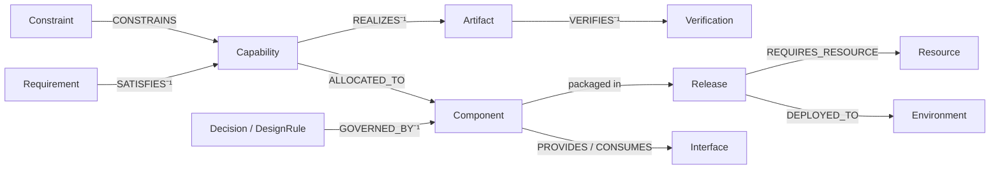

# Impact Propagation — the PROPAGATE step of the coherence loop

> Part of the **Reflow 2.0** design docs — see **[overview.md](overview.md)** for the full map and reading order.

> When something changes in any phase, this is what walks the **golden thread** to find
> everything the change touches — the *blast radius* — so DETECT/SURFACE can flag the new
> gaps and the graph can be healed back to coherence. This is the connective tissue of
> [the vision](vision.md).

Grounded in Reflow's existing `analyze_impact`
(`tools/reflow_mcp/src/reflow_mcp/tools/graph_intelligence.py`): a bounded BFS over
structural + inference edges, classifying direct vs. transitive impact, flagging risk
edges, and finding coverage gaps. We keep that engine and mature it with **edge-semantic
direction**, **the Z-axis** (change is a first-class event), and **dynograph-graph** for
the traversal.

---

## Trigger

Two entry points, same engine:

1. **Reactive** — a `ChangeEvent` was recorded (Axis Z). Its `CHANGED` target(s) are the
   propagation seeds. This is the automatic path the vision describes.
2. **Speculative** — a "what if I change X?" query before committing. Runs the same
   traversal without writing a `ChangeEvent`, so the user can see the blast radius first.

---

## The golden thread (what we traverse)

Impact flows along the traceability edges that tie intent → realization → operation:

Plus the inference "why" edges (`CAUSES`, `ENABLES`, `BLOCKS`, `RISKS`, `MITIGATES`,
`CONTRADICTS`, …) which carry `confidence` and let impact follow causal, not just
structural, links.

---

## Direction matters (the maturation over plain BFS)

Reflow's BFS is undirected — correct for recall, but it loses *why* a node is impacted.
We classify each traversal edge by the **semantic direction** of impact:

| Direction | Question it answers | Example |
|---|---|---|
| **Downstream** (realization) | "what did this node's existence justify or shape?" | change a `Requirement` → the `Capability` that `SATISFIES` it, the `Component`, `Artifact`, and `Verification` down the chain may now be wrong |
| **Upstream** (rationale) | "what intent does this node serve, that may now be unmet?" | change a `Component` → the `Requirement`/`Constraint` it was satisfying may no longer be met |
| **Lateral** (peers/contracts) | "what shares a contract or depends sideways?" | change an `Interface` → every `Component` that `CONSUMES` it |
| **Causal** (inference) | "what did this cause/enable/risk?" | a failed `Verification` `CAUSES` a fix that ripples to its `Artifact` |

The traversal is edge-type-aware: each edge type declares which direction(s) it
propagates, so the blast radius is *explained*, not just enumerated.

---

## Impact kinds (what a ripple means, in design terms)

As nodes are reached, each is tagged with the *kind* of breakage the change implies —
these become the candidate gaps handed to SURFACE:

| Impact kind | Fires when the change… |
|---|---|
| `unmet_requirement` | breaks a `SATISFIES` link (the thing that met a Requirement changed) |
| `stale_verification` | invalidates a `Verification` (its target moved; test no longer proves the claim) |
| `violated_constraint` | pushes a node past a `Constraint`/`DesignRule` it must respect |
| `orphaned_artifact` | removes/replaces what an `Artifact` `REALIZES` |
| `phase_desync` | leaves a downstream phase (build/verify/operate) inconsistent with an upstream one |
| `introduced_contradiction` | creates a `CONTRADICTS` between two now-incompatible nodes |
| `undersized_resource` | changes a `Release`/`Component`'s needs beyond a `Resource` spec |
| `coverage_gap` | adds/changes a node with no `Verification` yet (reuse Reflow's test-gap scan) |

---

## Ranking the blast radius

Not every affected node matters equally. Rank so SURFACE asks about the important ones
first:

- **Distance** — direct (1 hop) outranks transitive; **confidence decays with depth**
  (multiply inference-edge `confidence` along the chain).
- **Risk edges** — a path crossing `RISKS`/`BLOCKS`/`CONTRADICTS`/`VIOLATES`/`MASKS`
  amplifies severity (kept verbatim from Reflow's `risk_rel_types`).
- **Centrality** — a change hitting a high-centrality / single-point-of-failure node
  (via `dynograph-graph`) has a wider blast radius; weight it up.
- **Criticality** — inherit the affected node's `priority`/`severity` (a `critical`
  Constraint outranks an `info` one).

---

## Axis-Z integration

- Propagation runs **in the current epoch**; each impacted node is flagged relative to the
  `ChangeEvent` that seeded the run.
- The change's *cause* is already on the graph (inference `CAUSES`/`TRIGGERS` into the
  `ChangeEvent`), so impact can report the full chain: *cause → change → blast radius*.
- Prior state is snapshotted (per the extraction plan's time-aware integration), so a
  speculative run can diff "before vs. after this change" without mutating anything.

---

## Non-negotiable disciplines

1. **Bound the traversal, but never silently truncate.** Cap depth for performance, but
   report "N further nodes beyond depth K" — a hidden truncation is a silent integrity
   loss (same bar as the extraction no-silent-fallback rule).
2. **Explain every impact.** Each affected node carries the `via` edge chain and the
   impact `kind` — never an unexplained "this is affected."
3. **Scope per project.** Traverse within the project's subgraph via an indexed
   `project_id` where-prefilter (dynograph's per-property algo scoping), so one program's
   ripple can't wander into another's.
4. **Deterministic + cacheable.** Same seed + same graph epoch → same blast radius; cache
   keyed by (seed, epoch-hash) with a short TTL.
5. **Feed the loop, don't fix.** Impact propagation only *computes and tags*; turning
   tags into questions is SURFACE (gap-surfacing), and repair is HEAL. Keep the concerns
   separate.

---

## Reuse vs. build

| asset | plan |
|---|---|
| Reflow `analyze_impact` (BFS, direct/transitive split, risk-edge flags, test-gap scan) | **reuse the engine**; add edge-semantic direction + impact-kind tagging |
| `dynograph-graph` crate (paths, components, centrality) | **reuse** for the traversal + centrality weighting |
| inference-edge `confidence` | **reuse** for depth-decay ranking |
| Axis-Z `ChangeEvent` / snapshots ([schema/temporal.yaml](../schema/temporal.yaml)) | **reuse** as the reactive trigger + before/after diff |
| change-type semantics (`modify` / `add` / `remove` / `deprecate`) | **extend** Reflow's `change_type` so removal propagates as orphaning, addition as coverage gaps |
