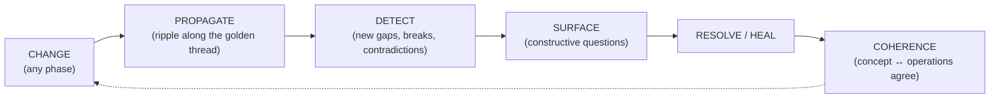

# Vision — one coherent graph from concept to operations

> Part of the **Reflow 2.0** design docs — see **[overview.md](overview.md)** for the full map and reading order.

> This is the north star. Everything else in `redesign/` (the schema, the extraction
> pipeline, gap-surfacing, heal, the three axes) exists to serve this.

## The problem

A person has an idea. They may know little about systems engineering, how to organize a
project, or the gates a program passes through from concept to operations & maintenance.
Even for experts, the hardest part isn't any single phase — it's the **transitions
between them**, where most real programs break:

- **concept → design**: a concept is specified that can't actually be designed within the
  real constraints.
- **design → build**: something is designed that can't realistically be built.
- **build → operate**: an engineer builds *exactly* to the requirements, yet an operator
  can't realistically use the result.
- **late change (any → all)**: a decision-maker updates the initial requirements late in
  development or test — and every downstream artifact silently falls out of sync.

Traditionally, absorbing one change means manually chasing it through every artifact in
every phase — concept, design, build, test, production, O&M. That burden is so high it
usually *doesn't happen*, and the program drifts into incoherence: rework, cost, and
fielded systems that don't meet the need.

## The thesis

Capture the **entire lifecycle — concept → operations — in one graph**, with the
traceability that ties every artifact back to the intent it serves (the systems-
engineering *golden thread*). Once it's all in one connected graph, a change *anywhere*
can be propagated *everywhere*: the system automatically detects the ripple effects (new
gaps, broken links, contradictions), **surfaces them to the user as plain questions**,
and **heals** the graph back to coherence — so concept through operations stays in
agreement, always.

The user never has to know systems engineering. The graph knows the structure; the
system asks the right questions at the right time and keeps the whole thing consistent.

## The coherence loop

The whole system, in one loop:

| Step | Mechanism in this design |
|---|---|
| **CHANGE** | Axis Z — any edit becomes a `ChangeEvent` at a `DesignEpoch` ([schema/temporal.yaml](../schema/temporal.yaml)); the old state is snapshotted, never clobbered |
| **PROPAGATE** | Axis X — walk the traceability edges (`SATISFIES` · `ALLOCATED_TO` · `REALIZES` · `VERIFIES` · `DEPLOYED_TO` · `DEPENDS_ON` + inference) up- and downstream to compute the blast radius ([impact-propagation.md](impact-propagation.md)) |
| **DETECT** | the touched region is re-diagnosed for new gaps, dangling links, contradictions, and phase-coverage holes |
| **SURFACE** | gap-surfacing turns each into a plain-language question ([docs/gap-surfacing.md](gap-surfacing.md)) |
| **RESOLVE / HEAL** | the user answers (→ INGEST) or HEAL proposes structural fixes ([docs/heal-process.md](heal-process.md)); provenance recorded, prior state remembered |

## Worked example — the general's late requirement

1. Late in test, a stakeholder changes requirement **R-04** ("range 50 km" → "range 200 km").
2. **CHANGE**: a `ChangeEvent{change_type: requirement_creep}` is recorded at epoch *v1.3*;
   R-04's prior state is snapshotted.
3. **PROPAGATE**: the golden thread shows R-04 is `SATISFIES`-linked from Capability
   *C-Propulsion*, `ALLOCATED_TO` Component *Engine*, `REALIZES`-d by Artifact
   *engine_spec*, `VERIFIES`-d by Verification *range_test*, and `DEPLOYED_TO`
   Environment *field*.
4. **DETECT**: `range_test` no longer validates R-04; *Engine* may now violate a
   weight `Constraint`; the deploy plan's fuel `Resource` is now under-specified.
5. **SURFACE**: "Requirement R-04 changed to 200 km. This breaks the range test, may
   violate the 500 kg weight limit on the Engine, and changes fuel needs for field
   deployment. Want to update these together?"
6. **RESOLVE/HEAL**: the user (guided) updates each; the graph returns to coherence, and
   *v1.2 → v1.3* is diffable forever.

What used to be weeks of manual artifact-chasing becomes a guided, minutes-long pass.

## Why this design guarantees it

- **The golden thread is native.** Traceability edges mean nothing is an island — every
  artifact links to the intent it serves, so impact is always *computable*, not guessed.
- **Cross-phase from day one.** The schema spans P0–P5, so concept and operations live in
  the *same* graph and can be checked against each other continuously.
- **Change is first-class (Axis Z).** A late requirement change is a modeled event with a
  cause, not a silent overwrite — the ripple is *derived from it*.
- **Domain-neutral.** The same loop serves software, hardware, a document, or a full
  acquisition program — "design anything, build anything."

## What "good" looks like

- Someone with only an idea is guided — by questions — from concept to operations without
  needing to know systems engineering.
- Any late change is absorbed quickly: the system shows exactly what it broke and walks
  the user through fixing it.
- The graph is *always* coherent: no phase silently drifts from another, and the full
  history is queryable.
